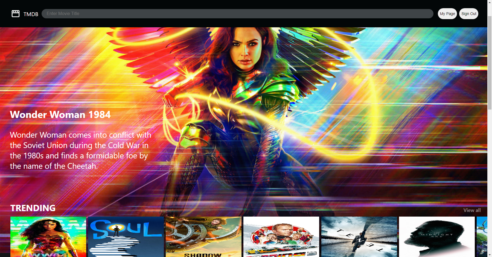
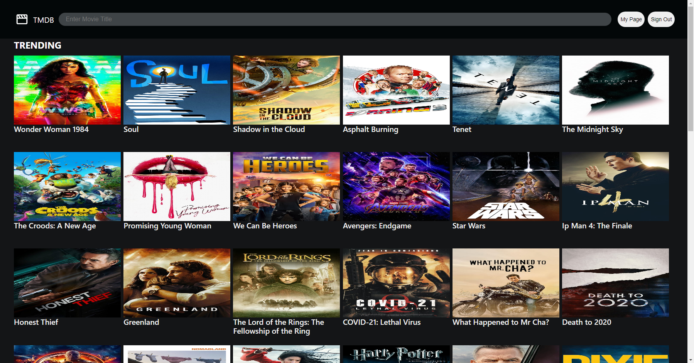
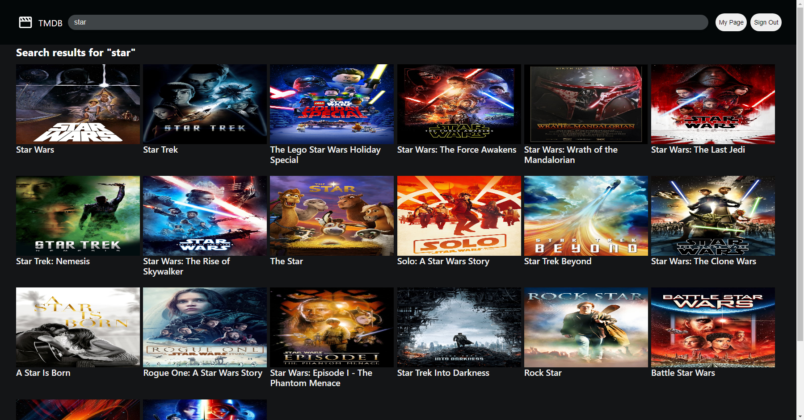
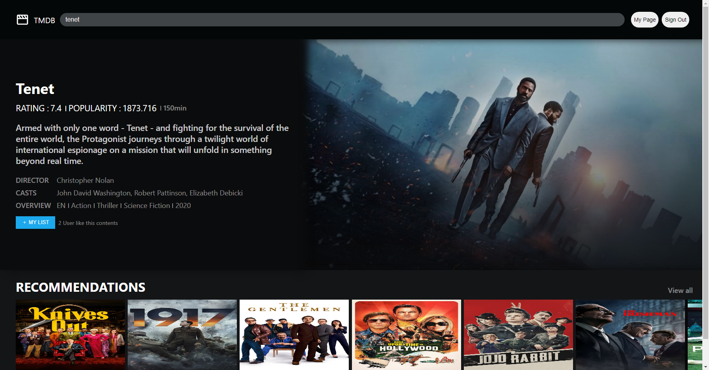

## Project

- 영화를 검색해서 정보를 얻을 수 있는 웹 어플리케이션입니다
- 다음과 같은 주요 기능을 구현하였습니다

  - 회원가입, 로그인, 로그아웃 및 유저의 상태에 따라 컴포넌트 접근을 제한하는Authentification Check 구현
  - Carousel slider 방식으로 카테고리 별 추천 영화 제공
  - 해당 카테고리의 모든 영화를 볼 수 있는 Infinite Scrolling 기능 구현
  - 검색한 영화에 대한 정보 제공 및 해당 영화와 관련된 영화 추천
  - 내가 좋아하는 영화를 리스트에 추가할 수 있는 기능

- heroku를 사용해서 배포하였습니다.
- [https://the-movie-api-app.herokuapp.com/](https://the-movie-api-app.herokuapp.com/)

---

## Installation

- dev.js 파일을 `server/config` 폴더 안에 추가합니다.

```jsx
module.exports = {
  mongoURI: 'mongoDB URL',
};
```

- Root Directory

```bash
$ npm install
```

- Client Directory

```bash
$ cd client
$ npm instal
```

---

## 화면

|              홈              |             카테고리             |
| :--------------------------: | :------------------------------: |
|  |  |

|             회원가입             |            로그인             |
| :------------------------------: | :---------------------------: |
|  |  |

|          모두보기           |             검색              |
| :-------------------------: | :---------------------------: |
|  |  |

|         상세페이지          |            MY PAGE            |
| :-------------------------: | :---------------------------: |
|  |  |

---

## Browsers support

- 다음과 같은 웹 브라우저 환경에서 동작합니다.

| Chrome | Microsoft Edge | Firefox | Naver Whale |
| :----: | :------------: | :-----: | :---------: |
|  87.0  |      87.0      |  83.0   |     2.8     |

---

## APIs

- [The Movie API](https://developers.themoviedb.org/3)

---

## Backend

&nbsp;

### Skill Stack

- Node.js
- Mongo DB

### Folder Structure

```
├─ server
├─── config
├─── middleware
├─── models
├─── routes
├─── index.js

```

- config

  - Database 접근과 관련된 작업을 처리하는 곳입니다

  - Development mode에서는 local에서, Production mode에서는 Heroku에 등록한 Config Vars에서 Database 접근을 위한 key를 가져옵니다

- middleware

  - Authentification Check를 하기 위한 auth.js 파일이 있습니다

  - 로그인한 사용자만 들어갈 수 있는 페이지가 있었기 때문에 Frontend에서는 모든 페이지에 접근하기 전 Authentification Check를 해줍니다

  - 클라이언트 Cookie에서 저장된 Token을 Sever에 가져와서 Decoding 하면 UserID를 찾을 수 있습니다. 해당 UserID가 데이터베이스에 있는지 확인한 다음 일치하는 유저가 있는지 확인한 다음 적절한 결과를 전달해줍니다

- models

  - Likes.js

    - 내가 관심있는 영화를 저장하기 위한 Schema가 정의되어 있습니다

  - Users.js

    - 유저 정보를 저장하기 위한 Schema가 정의되어 있습니다.
    - Password 확인, Token 발급, Token decoding와 같은 유저와 관련된 기능들을 수행하기 위한 함수들이 정의되어 있습니다.

- routes

  - likes.js

    - 관심있는 영화를 MY LIST에 추가하는 기능과 관련된 endpoint가 있는 폴더
    - `/likeNumber` - 해당 영화를 얼마나 많은 User가 MY LIST에 추가했는지 보여줍니다
    - `/liked` - 내가 이 영화를 MY LIST에 추가했는지 확인
    - `/removeFromLiked` - MY LIST에 추가한 영화 삭제
    - `/addToLike` - MY LIST에 추가
    - `/getLikedMovie` - My Page에서 내가 MY LIST 에 추가한 영화들을 보여줍니다

    &nbsp;

  - users.js

    - 유저와 관련된 endpoint가 있는 폴더
    - `/login` - 로그인 endpoint
    - `/auth` - Authentification Check를 하기 위한 endpoint. User의 상태에 따른 결과를 frontend에 보내줍니다
    - `/register` - 회원 가입 endpint
    - `/logout` - 로그아웃 endpoint

---

## Client

### Skill Stacks

- React.js
- Scss
- Redux

### Folder Structure

```
├─ client/src
├─── _actions
├─── _reducers
├─── components/views
├─────── Card
├─────── contentPage
├─────── DisplayPage
├─────── LandingPage
├─────── LikePage
├─────── LoginPage
├─────── Navbar
├─────── RegisterPage
├─────── SearchMovie
├─────── utils
├─────── ViewAllPage
├─── hoc

```

- \_actions

  - redux의 action을 위한 folder로 dispatch에 따라 endpoint로 request를 보내는 함수들이 정의되어 있습니다

- \_reducers

  - redux의 reducer을 위한 folder로 action에 따라 state를 update해서 return 해줍니다.

- components/views

  - UI 컴포넌트들이 정의되어 있습니다.

  - Card

    - 각 영화의 포스터를 보여주기 위한 컴포넌트입니다

  - contentPage

    - 영화에 대한 기본정보 및 관련있는 다른 추천 영화가 표시되는 페이지입니다
    - MY LIST 버튼을 눌러서 내가 좋아하는 영화를 목록에 추가할 수 있습니다

  - DisplayPage

    - Carousel slider 방식으로 카테고리 별로 영화를 보여주기 위한 컴포넌트 입니다.
    - DisplayPage 컴포넌트 안에서 Card 컴포넌트의 영화 포스터가 보여집니다

  - LandingPage

    - 기본적으로 화면에 표시되는 페이지로 카테고리에 따른 영화 정보를 보여줍니다

  - LikePage

    - MY LIST에 추가한 영화들을 보여줍니다

  - LoginPage

    - 로그인을 위한 페이지입니다

  - Navbar

    - 항상 페이지 상단에 고정되어 있으며 영화를 검색할 수 있습니다.

  - RegisterPage

    - 회원가입을 위한 페이지입니다

  - SearchMovie

    - 영화 제목을 검색했을 때 결과를 보여주는 페이지입니다

  - utils

    - 여러 가지 상황에서 사용될 수 있는 컴포넌트를 위한 폴더
    - 페이지를 찾을 수 없을 때 화면에 보여주기 위한 컴포넌트가 있습니다

  - ViewAllPage

    - 카테고리 별로 영화가 Carousel Slider 방식으로 보여지는데 모든 영화를 보고 싶은 경우 View all 버튼을 누르면 해당 카테고리에 해당하는 모든 영화를 볼 수 있습니다

    - Infinite Scrolling 방식을 구현해서 스크롤을 내리면 계속해서 영화 목록을 볼 수 있습니다.

- hoc (Higer-Order Component)

  - Authentificaton check를 위한 auth.js가 정의 되어 있는 폴더

  - 로그인 하지 않은 사용자가 로그인한 사용자만 접속할 수 있는 My Page와 같은 페이지에 접근하려고 하거나 로그인한 사용자가 로그인 하지 않은 사용자만 접속할 수 있는 Login, Register와 같은 페이지에 접근하려고 할 때 이를 막고 다른 페이지로 이동하게 됩니다.
